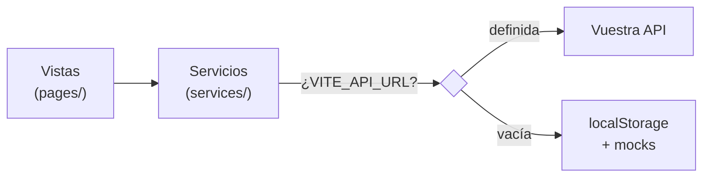

# Cómo enchufar el backend a TourPoints

> Para el equipo de backend. Escrito desde el frontend, leyendo vuestro `endpoints_api.md`,
> `logica_negocio.md` y `schem_posgrest.sql`. Verificado contra el código real el 2026-07-15.
>
> **Si solo leéis una cosa:** la sección 3. Os ahorra construir cosas que no hay que construir.

---

## 1. Los 60 segundos que necesitáis

TourPoints es una SPA en **JavaScript vanilla** (sin React, sin framework). Vite, un router
propio, y una regla que se ha respetado sin excepción:

> **Ninguna vista habla HTTP. Todas piden los datos a la capa de servicio.**



Esa frontera es todo lo que os importa. **Vosotros solo existís detrás de `services/`.**
Cuando cambiéis algo, no se rompe una pantalla: se rompe un servicio, y se arregla en un archivo.

---

## 2. La única carpeta

`frontend/src/services/` — 12 archivos. No hay que mirar nada más.

| Archivo | De qué manda | Estado |
|---|---|---|
| `api.client.js` | El cliente HTTP. **Toda** petición pasa por aquí | 🔴 solo sabe hacer `GET` |
| `poi.service.js` | POIs | 🟡 lee por HTTP, escribe en localStorage |
| `createCrudService.js` | Fábrica: retos, recompensas y usuarios salen de aquí | 🟡 igual |
| `auth.service.js` | Sesión | 🔴 modo demo, sin contraseña ni token |
| `favorite.service.js` | Favoritos | 🔴 localStorage puro |
| `review.service.js` | Reseñas | 🔴 localStorage puro |
| `visit.service.js` | Check-ins | 🔴 localStorage puro, da 0 puntos |
| `challengeProgress.service.js` | Progreso de retos por usuario | 🔴 localStorage puro |
| `localStore.js` | El sustituto de la base de datos mientras no estáis | se borra entero el día que lleguéis |

**El interruptor** está en `frontend/.env`:

```bash
VITE_API_URL=http://localhost:8000/api/v1   # ← con esto, el frontend os habla
# VITE_API_URL=                             # ← vacío: mocks locales
```

Un solo archivo lo lee (`config/enviroment.js` — sí, con el typo). Nadie más toca `import.meta.env`.

---

## 3. ⚠️ Los endpoints de nuestro código son ficción. No los construyáis.

Esto es lo importante y por eso va antes que nada.

Cada servicio nuestro tiene una cabecera así:

```js
// ── ENDPOINTS esperados (backend) ─────────────
//   GET    /pois              → POIs publicados
//   POST   /admin/pois        → crear
```

**Los inventamos antes de leer vuestro contrato.** No os describen a vosotros: describen lo que
imaginamos. Vuestro `endpoints_api.md` es la verdad. Comparad:

| Nosotros imaginamos | Vosotros tenéis | ¿Quién manda? |
|---|---|---|
| `GET /pois` | `GET /poi` | **Vosotros** |
| `GET /admin/pois` | `GET /poi?estado=PENDIENTE` | **Vosotros** |
| `GET /admin/challenges` | `GET /retos` | **Vosotros** |
| `POST /me/challenges/:id/start` | `POST /retos/{id}/inscribirme` | **Vosotros** |
| `GET /admin/rewards` | `GET /recompensas` | **Vosotros** |
| `POST /api/favorites/:id` | `POST /favoritos` | **Vosotros** |
| `POST /api/visits` | `POST /visitas` | **Vosotros** |

**No cambiéis ni un endpoint para parecerte a nuestros comentarios.** Nosotros borramos esas
cabeceras y adaptamos. Vosotros construid vuestro contrato tal cual está escrito.

Lo mismo con el idioma y la forma: vosotros habláis **español, UUID y paginado**; nosotros por
dentro hablamos inglés, enteros y arrays pelados. **La traducción es problema nuestro**, y cabe
en `services/`. No aplanéis `ubicacion` ni quitéis `items` por nosotros.

---

## 4. El mapa de encendido: qué endpoint enciende qué pantalla

Ordenado por **retorno visible**, no por dificultad. Cada fila enciende algo que se ve.

| # | Lo que entregáis | Lo que se enciende | Auth |
|---|---|---|---|
| **1** | `GET /categorias-poi` + `GET /poi` | **Tres pantallas de golpe**: Portada, Explora y Mapa. Con buscador, filtros y paginación ya hechos | ❌ no |
| **2** | `GET /poi/{id}` | Detalle del POI, con su mapa | ❌ no |
| **3** | `POST /auth/register` · `POST /auth/login` · `GET /usuarios/me` | Sesión de verdad. Desbloquea **todo** lo de abajo | — |
| **4** | `GET /favoritos/me` · `POST /favoritos` · `DELETE /favoritos/{poi_id}` | Corazones + vista Favoritos | ✅ |
| **5** | `GET /poi/{id}/comentarios` · `POST` · `GET .../calificaciones/resumen` | Reseñas y escribir comentarios | ✅ |
| **6** | `GET /retos` · `GET /retos/me` · `POST /retos/{id}/inscribirme` | Vista Retos con progreso | ✅ |
| **7** | `POST /visitas` | Check-in con GPS. **El corazón del producto** | ✅ |
| **8** | `GET /puntos/me/saldo` · `GET /puntos/me/movimientos` | Saldo real + historial (dashboard, en diseño) | ✅ |
| **9** | `GET /recompensas` · `POST /recompensas/{id}/canjear` · `GET /canjes/me` | Recompensas y canjes | ✅ |

**Empezad por la 1.** Es el mayor golpe de efecto del proyecto: sin login, sin tokens, sin
escritura, un solo `GET` y tres pantallas dejan de mentir. Si ese día `VITE_API_URL` apunta a
vuestro servidor y la portada muestra vuestros POIs, ya está integrado el 40% de lo visible.

---

## 5. Las 6 colisiones que hay que decidir (no son bugs, son decisiones)

Nuestro modelo y el vuestro no encajan en seis puntos. Cuatro los arreglamos nosotros. **Dos
necesitan que decidáis vosotros.**

### 🟢 Las que resolvemos nosotros, sin tocaros

1. **Idioma.** `nombre`→`name`, `descripcion`→`description`, `ubicacion:{lat,lng}`→`lat`,`lng`.
2. **IDs.** Vosotros UUID, nosotros enteros. Nos adaptamos; las rutas `/poi/:id` ya son texto.
3. **Paginación.** Vosotros `{items,total,page,page_size}`, nosotros arrays. Lo desenvolvemos.
4. **Estados.** Vuestro `APROBADO` es nuestro `Activo`. Mapeamos.

### 🔴 Las que necesitan vuestra decisión

**5. Un POI no tiene puntos en vuestro modelo — y nuestra UI los promete.**

Cada tarjeta del frontend enseña un badge **"+250 puntos"**. En vuestro esquema `poi` **no tiene
columna de puntos**: los puntos los decide `reglas_puntos` por evento, en el momento de validar
la visita. Es mejor diseño que el nuestro, pero deja la UI sin número que enseñar.

Opciones, de menos a más trabajo para vosotros:
- **(a)** Exponer en `GET /poi` un `puntos_visita` calculado resolviendo `reglas_puntos` para ese POI. La UI no cambia.
- **(b)** Que el frontend deje de prometer un número y diga "gana puntos". Cero trabajo backend, pero pierde gancho.

Necesitamos saber cuál antes de tocar la tarjeta.

**6. Nuestras reseñas son una cosa; las vuestras son dos.**

Nosotros pintamos una tarjeta con **autor + estrellas + texto** juntos. Vosotros lo tenéis
partido, y bien partido: `calificaciones` (1-5, una por usuario y POI) y `comentarios` (texto,
con moderación). Son tablas distintas y endpoints distintos.

Además: **vuestros comentarios nacen `PENDIENTE`.** Hoy el usuario escribe y ve su comentario
al instante. Con vosotros escribirá y **no verá nada** hasta que un admin lo apruebe. Eso hay
que contarlo en la interfaz, y hay que construir la cola de moderación en el panel de admin.

Necesitamos decidir: ¿unimos calificación y comentario en un solo gesto de UI (dos llamadas
por debajo), o los separamos como los tenéis vosotros?

### 🟡 Y tres avisos, más pequeños pero traicioneros

- **`type` significa cosas distintas en cada lado.** Nuestro reto tiene `type: "Cultural"`; el
  vuestro `tipo: "VISITA"`. **Mismo nombre, semánticas incompatibles.** Cuidado al leer código nuestro.
- **`image`, `emoji`, `difficulty` y `category` de recompensa no existen en vuestro esquema.**
  Son adornos que inventamos. O caben en algún `metadata`/`configuracion` JSONB, o los quitamos.
- **Nuestro reto tiene `points` y `deadline`; el vuestro tiene `recurrencia`, `cantidad_requerida`
  y `modo_recompensa`.** Vuestro modelo de retos es bastante más rico que nuestra UI. La vista de
  Retos se va a quedar corta y habrá que rediseñarla — no es trabajo vuestro, pero conviene que
  sepáis por qué os vamos a preguntar por `progreso` y `porcentaje`.

---

## 6. Un endpoint aterrizando, de principio a fin

Así se ve el día 1 con `GET /poi`. **Nada fuera de `services/` se toca.**

Hoy:

```js
// services/poi.service.js
export async function getPois(filters = {}) {
  if (isApiEnabled()) {
    return apiGet("/pois", { category: filters.category, q: filters.query });
  }
  return readCollection(COLLECTION, mockPois).filter((poi) => poi.status === "Activo");
}
```

Con vosotros:

```js
export async function getPois(filters = {}) {
  if (isApiEnabled()) {
    const res = await apiGet("/poi", { q: filters.query, categoria_id: filters.categoryId });
    return res.items.map(adaptPoi);        // ← desenvuelve {items,...} y traduce
  }
  return readCollection(COLLECTION, mockPois).filter((poi) => poi.status === "Activo");
}
```

Y un adaptador, que es todo el pegamento que existe:

```js
function adaptPoi(p) {
  return {
    id: p.id,
    name: p.nombre,
    category: p.categoria.nombre,
    image: p.imagen_principal,
    rating: p.calificacion_promedio,
    reviewCount: p.total_calificaciones,
    lat: p.ubicacion.lat,
    lng: p.ubicacion.lng,
    status: p.estado === "APROBADO" ? "Activo" : p.estado,
  };
}
```

Eso es todo. La portada, Explora y el Mapa ya funcionan: nunca supieron de dónde salían los datos.

---

## 7. Lo que falta de nuestro lado (y es culpa nuestra)

Honestidad para que no perdáis tiempo:

> **`api.client.js` solo sabe hacer `GET`.** No existe `apiPost`, ni `apiPut`, ni `apiDelete`.

Y peor: en `createCrudService.js` y `poi.service.js`, **solo la lectura mira `isApiEnabled()`**.
`create`, `update` y `remove` escriben en localStorage **sin preguntar**:

```js
async list()       { if (isApiEnabled()) return apiGet(apiPath); ... }  // ✅ conmuta
async create(data) { const items = readCollection(collection, seed); ... } // ❌ nunca pregunta
```

**Qué significa esto para vosotros:** el día que definamos `VITE_API_URL`, las lecturas irán a
vuestra API y **las escrituras se quedarán calladas en el navegador**. Un admin creará un POI, lo
verá aparecer, recargará y habrá desaparecido. Parecerá un bug vuestro y no lo será.

Es lo primero de nuestra lista. **Hasta que esté, integrad solo lecturas** (pasos 1 y 2 del mapa)
— que además son justo por donde hay que empezar.

---

## 8. Reglas de la casa

- **No adaptéis vuestro contrato a nuestro código.** La traducción vive en `services/`, es nuestra.
- **Errores:** ya distinguimos `404` de caída (clase `ApiError` con `status`). Mandad `409` con
  `detail` descriptivo para las reglas de negocio (stock, duplicados) y lo pintamos tal cual.
- **CORS:** el dev server va en `http://localhost:5173`.
- **Timeout:** abortamos a los 8s (`config/api.js`). Si algún endpoint pesado necesita más, decidlo.
- **El rol hoy es mentira.** Vive en `localStorage['role']` y cualquiera puede escribirlo desde la
  consola. Lo sabemos y está documentado. **La autorización real es vuestra, en cada endpoint** —
  no confiéis en que el frontend esconda el panel de admin.

---

## Lo primero, mañana

1. Levantad `GET /categorias-poi` y `GET /poi` con datos reales de Barranquilla.
2. Decidnos la URL.
3. Ponemos `VITE_API_URL` y adaptamos `poi.service.js`.
4. Tres pantallas dejan de ser mentira el mismo día.

Todo lo demás cuelga de ahí. El resto del estado del frontend, con sus huecos sin maquillar, está
en `docs/ESTADO_PROYECTO.md`.
