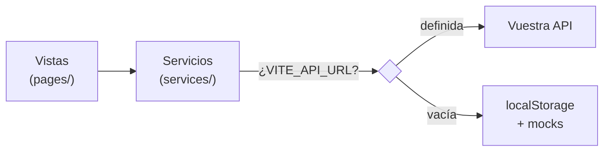

# Cómo enchufar el backend a TourPoints

> Para el equipo de backend. Escrito desde el frontend, leyendo vuestro `endpoints_api.md`,
> `logica_negocio.md` y `schem_posgrest.sql`. Verificado contra el código real el 2026-07-15.
>
> **Si solo leéis una cosa:** la sección 3. Os ahorra construir cosas que no hay que construir.

## Veredicto en una línea

**El frontend adopta vuestro modelo de negocio.** Es viable, y vuestro diseño es mejor que el
nuestro en casi todo. Os pedimos adecuar **solo tres cosas** (sección 5.B) y necesitamos **tres
decisiones conjuntas** (5.C). Nada más.

Lo que hace esto posible es una regla que el frontend ha respetado sin excepción: **ninguna vista
habla HTTP**. Toda la traducción cabe en una carpeta.

---

## 1. Los 60 segundos que necesitáis

TourPoints es una SPA en **JavaScript vanilla** (sin React, sin framework). Vite, un router
propio, y una regla que se ha respetado sin excepción:

> **Ninguna vista habla HTTP. Todas piden los datos a la capa de servicio.**



Esa frontera es todo lo que os importa. **Vosotros solo existís detrás de `services/`.**
Cuando cambiéis algo, no se rompe una pantalla: se rompe un servicio, y se arregla en un archivo.

---

## 2. La única carpeta

`frontend/src/services/` — 12 archivos. No hay que mirar nada más.

| Archivo | De qué manda | Estado |
|---|---|---|
| `api.client.js` | El cliente HTTP. **Toda** petición pasa por aquí | 🔴 solo sabe hacer `GET` |
| `poi.service.js` | POIs | 🟡 lee por HTTP, escribe en localStorage |
| `createCrudService.js` | Fábrica: retos, recompensas y usuarios salen de aquí | 🟡 igual |
| `auth.service.js` | Sesión | 🔴 modo demo, sin contraseña ni token |
| `favorite.service.js` | Favoritos | 🔴 localStorage puro |
| `review.service.js` | Reseñas | 🔴 localStorage puro |
| `visit.service.js` | Check-ins | 🔴 localStorage puro, da 0 puntos |
| `challengeProgress.service.js` | Progreso de retos por usuario | 🔴 localStorage puro |
| `localStore.js` | El sustituto de la base de datos mientras no estáis | se borra entero el día que lleguéis |

**El interruptor** está en `frontend/.env`:

```bash
VITE_API_URL=http://localhost:8000/api/v1   # ← con esto, el frontend os habla
# VITE_API_URL=                             # ← vacío: mocks locales
```

Un solo archivo lo lee (`config/enviroment.js` — sí, con el typo). Nadie más toca `import.meta.env`.

---

## 3. ⚠️ Los endpoints de nuestro código son ficción. No los construyáis.

Esto es lo importante y por eso va antes que nada.

Cada servicio nuestro tiene una cabecera así:

```js
// ── ENDPOINTS esperados (backend) ─────────────
//   GET    /pois              → POIs publicados
//   POST   /admin/pois        → crear
```

**Los inventamos antes de leer vuestro contrato.** No os describen a vosotros: describen lo que
imaginamos. Vuestro `endpoints_api.md` es la verdad. Comparad:

| Nosotros imaginamos | Vosotros tenéis | ¿Quién manda? |
|---|---|---|
| `GET /pois` | `GET /poi` | **Vosotros** |
| `GET /admin/pois` | `GET /poi?estado=PENDIENTE` | **Vosotros** |
| `GET /admin/challenges` | `GET /retos` | **Vosotros** |
| `POST /me/challenges/:id/start` | `POST /retos/{id}/inscribirme` | **Vosotros** |
| `GET /admin/rewards` | `GET /recompensas` | **Vosotros** |
| `POST /api/favorites/:id` | `POST /favoritos` | **Vosotros** |
| `POST /api/visits` | `POST /visitas` | **Vosotros** |

**No cambiéis ni un endpoint para parecerte a nuestros comentarios.** Nosotros borramos esas
cabeceras y adaptamos. Vosotros construid vuestro contrato tal cual está escrito.

Lo mismo con el idioma y la forma: vosotros habláis **español, UUID y paginado**; nosotros por
dentro hablamos inglés, enteros y arrays pelados. **La traducción es problema nuestro**, y cabe
en `services/`. No aplanéis `ubicacion` ni quitéis `items` por nosotros.

Y lo mismo con la lógica de negocio: vuestra moderación, vuestro ledger, vuestro stock por
triggers y vuestro PostGIS **mandan**. El frontend se adapta. Las tres únicas excepciones están
en la sección 5.B, y son cosas que vuestro modelo no puede darnos, no cosas que hagáis mal.

---

## 4. El mapa de encendido: qué endpoint enciende qué pantalla

Ordenado por **retorno visible**, no por dificultad. Cada fila enciende algo que se ve.

| # | Lo que entregáis | Lo que se enciende | Auth |
|---|---|---|---|
| **1** | `GET /categorias-poi` + `GET /poi` | **Tres pantallas de golpe**: Portada, Explora y Mapa. Con buscador, filtros y paginación ya hechos | ❌ no |
| **2** | `GET /poi/{id}` | Detalle del POI, con su mapa | ❌ no |
| **3** | `POST /auth/register` · `POST /auth/login` · `GET /usuarios/me` | Sesión de verdad. Desbloquea **todo** lo de abajo | — |
| **4** | `GET /favoritos/me` · `POST /favoritos` · `DELETE /favoritos/{poi_id}` | Corazones + vista Favoritos | ✅ |
| **5** | `PUT /poi/{id}/mi-calificacion` · `GET .../calificaciones/resumen` · `GET`+`POST /poi/{id}/comentarios` | Estrellas y comentarios, ya partidos como los tenéis. Requiere que construyamos la cola de moderación en admin | ✅ |
| **6** | `GET /retos` · `GET /retos/me` · `POST /retos/{id}/inscribirme` | Vista Retos con progreso — **ver decisión C3: puede que la rediseñemos antes** | ✅ |
| **7** | `POST /visitas` | Check-in con GPS. **El corazón del producto** | ✅ |
| **8** | `GET /puntos/me/saldo` · `GET /puntos/me/movimientos` | Saldo real + historial (dashboard, en diseño) | ✅ |
| **9** | `GET /recompensas` · `POST /recompensas/{id}/canjear` · `GET /canjes/me` | Recompensas y canjes | ✅ |

**Empezad por la 1.** Es el mayor golpe de efecto del proyecto: sin login, sin tokens, sin
escritura, un solo `GET` y tres pantallas dejan de mentir. Si ese día `VITE_API_URL` apunta a
vuestro servidor y la portada muestra vuestros POIs, ya está integrado el 40% de lo visible.

---

## 5. La regla: manda vuestro modelo

**Decisión tomada (Nicolás, 2026-07-15):** el frontend **adopta vuestra lógica de negocio**.
Vuestro modelo es más maduro que el nuestro —moderación real, ledger append-only, stock con
triggers, PostGIS— y no tiene sentido que lo dobléis para encajar en unos mocks.

La excepción es corta y explícita: **cuando vuestro modelo dejaría sin datos a una funcionalidad
muy marcada de la interfaz, sois vosotros quienes adecuáis.** Son tres casos, están en 5.B, y son
los únicos.

### 5.A · Lo que adoptamos nosotros (no os cuesta nada)

| Colisión | Qué hacemos | Por qué vuestro modelo gana |
|---|---|---|
| **Idioma** (`nombre`/`descripcion`/`ubicacion`) | Adaptador en `services/` | Da igual, es cosmético. La traducción es nuestra |
| **Paginación** `{items,total,page,page_size}` | La desenvolvemos | Estándar y correcta |
| **`calificacion_promedio` / `total_calificaciones`** | Mapeo directo a `rating`/`reviewCount` | Idéntico |
| **Estados POI** (5 estados + moderación) | Rehacemos el panel admin: hoy tenemos un interruptor Activo/Inactivo, no una máquina de estados | El vuestro es un flujo de moderación real; el nuestro era un juguete |
| **Categorías desde catálogo** | Consumimos `GET /categorias-poi` | **Nos mejora**: hoy el mapa de iconos está copiado a mano en *tres* archivos (`explore.js`, `map.js`, `rewards.js`). Vuestro catálogo trae `icono` y `color`, así que borramos las tres copias |
| **Visitas / check-in** | Adoptamos `POST /visitas` entero | **Nos arregla un bug**: hoy registrar una visita otorga 0 puntos y no valida nada. Vosotros validáis por GPS contra `radio_validacion` y devolvéis `puntos_otorgados` |
| **Comentarios + calificaciones separados** | Partimos la UI en dos gestos y construimos la cola de moderación en el panel admin | **Vuestro diseño es mejor y lo aceptamos.** El `UNIQUE(usuario_id, poi_id)` impide el spam de reseñas que hoy permitimos, y `PUT` idempotente es lo correcto |
| **Auth JWT** | Contraseñas reales, token, header `Authorization`, manejo del 401 | Lo nuestro es un placeholder declarado: "modo demo, sin contraseñas a propósito" |

> **Sobre comentarios:** aceptamos que nazcan `PENDIENTE`. Implica que el usuario escriba y **no
> vea su comentario** hasta que se apruebe — lo contaremos en la interfaz ("pendiente de
> revisión") y construiremos la cola de moderación. Es trabajo nuestro, no vuestro.

### 5.B · Lo que os pedimos adecuar (rompe algo muy marcado del frontend)

Solo tres. Cada uno deja una funcionalidad central sin dato que enseñar.

---

**🔴 B1 · Un POI necesita exponer sus puntos**

Cada tarjeta de POI lleva un badge **"+250 puntos"**. Está en la portada, en Explora, en
Favoritos y en el popup del mapa. **Es el gancho de gamificación de todo el producto**: es lo que
convierte una lista de sitios en un juego.

En vuestro esquema `poi` **no tiene columna de puntos** — los resuelve `reglas_puntos` por evento
al validar la visita. Vuestro diseño es mejor (los puntos son configurables y con prioridad), pero
deja la tarjeta muda: no podemos prometer un número que no existe hasta que el usuario ya visitó.

**Petición:** exponer en `GET /poi` y `GET /poi/{id}` un campo calculado, p. ej.
`puntos_visita`, resolviendo `reglas_puntos` para ese POI. Es una lectura, no cambia vuestro
modelo, y no toca la tabla.

Si decís que no, la alternativa es que la tarjeta deje de prometer una cifra y diga "gana puntos".
Se puede, pero pierde el gancho. **Preferimos (a) con diferencia.**

---

**🔴 B2 · `GET /poi` necesita un parámetro de ordenación**

Explora ofrece cuatro ordenaciones: **Recomendados** (por calificación), **Más puntos**,
**Menos puntos** y **Nombre (A-Z)**. El mapa añade **Distancia**.

Vuestro contrato tiene `q`, `categoria_id`, `ciudad_id`, `lat/lng/radio_metros`, `page` y
`page_size` — pero **ningún parámetro de orden**. Hoy ordenamos en cliente porque tenemos la lista
entera; en cuanto pagináis en servidor, ordenar en cliente ordena *solo la página visible*, que es
peor que no ordenar: parece que funciona y miente.

**Petición:** un `orden` en `GET /poi` con al menos `calificacion`, `nombre` y `distancia`
(este último ya lo tenéis resuelto: devolvéis `distancia_metros` cuando mandamos `lat`/`lng`).
Si aceptáis B1, añadid `puntos`.

**Alternativa temporal:** pedimos `page_size` alto y seguimos ordenando en cliente. Funciona
mientras Barranquilla tenga decenas de POIs; se cae cuando sean cientos. Sirve para arrancar,
no para producción.

---

**🔴 B3 · Retos y recompensas necesitan imagen**

La tarjeta de reto y la de recompensa son **diseños centrados en la imagen** — la foto ocupa la
mitad superior de la tarjeta. Vuestros `retos` y `recompensas` no tienen columna de imagen.

**Petición:** o una columna `imagen_url`, o una clave acordada dentro del JSONB que ya existe
(`retos.configuracion`, y algo equivalente en `recompensas`). Nos vale cualquiera de las dos, pero
necesitamos que sea **una clave fija y documentada**, no libre.

Lo demás de ese grupo lo cedemos nosotros: `difficulty` en retos y `emoji` en recompensas son
adornos que inventamos, y los quitamos sin discusión.

### 5.C · Decisiones conjuntas que no puede tomar ninguno solo

**C1 · ¿Cuál es la taxonomía de categorías?**
Nuestras categorías son **Cultura, Naturaleza, Gastronomía, Religiosa, Compras**. Vuestro
`categorias_poi` no viene precargado en el DDL y los ejemplos del contrato dicen *Museo*,
*Restaurante*. Son taxonomías distintas.

Aviso importante: nuestro CSS tiene **colores cableados por nombre de categoría**
(`.marker-pin-bubble.naturaleza`, `.gastronomia`, `.religiosa`...). Si la taxonomía cambia, los
pines del mapa pierden el color **en silencio**, sin error. Si vuestro catálogo trae `color`, lo
consumimos y el problema desaparece para siempre — pero hay que decidir el contenido del catálogo.

**C2 · ¿Quién calcula "Abierto ahora"?**
El detalle del POI muestra una insignia **"Abierto ahora"**. Hoy es mentira: viene cableada en el
mock (`schedule.isOpenNow: true`). Vosotros dais `horarios` como JSONB **de forma libre**, sin
validar por schema. Podemos calcularlo nosotros, pero solo si la forma está **fijada y
documentada**; con JSONB libre no hay nada que parsear con garantías.

Dos salidas: fijáis la forma de `horarios` y lo calculamos, o exponéis `abierto_ahora` ya resuelto.

**C3 · ¿Adoptamos el modelo de retos entero, ahora o después?**
Vuestro modelo de retos es **mucho más rico** que nuestra vista: `recurrencia`,
`cantidad_requerida`, `modo_recompensa`, periodos, `numero_intento`, `progreso`, `porcentaje`,
rachas, hitos. Nuestra página de Retos tiene tres estados (disponible / en curso / completado) y
una fecha límite.

Adoptarlo entero **no es adaptar: es rediseñar la vista**. No es trabajo vuestro, pero condiciona
el orden: o retrasamos Retos hasta rediseñarla, o hacemos una versión reducida que ignore
recurrencia y rachas y la ampliamos luego. **Es decisión de producto, no técnica.**

> ⚠️ **Trampa al leer nuestro código:** nuestro reto tiene `type: "Cultural"` y el vuestro
> `tipo: "VISITA"`. **Mismo nombre de campo, significados incompatibles.** Lo renombramos nosotros.

### 5.D · Roturas duras nuestras (las arreglamos, pero sabedlas)

Con vuestros UUID, dos cosas nuestras se rompen **hoy mismo**:

1. **La ruta del detalle solo acepta dígitos:** `pattern: /^\/poi\/(\d+)$/`. Un UUID **no casa** y
   el usuario recibe un 404. Es el bug más tonto y más seguro de esta integración.
2. **`visit.service.js` hace `Number(poiId)`** dos veces: con un UUID da `NaN` y falla en silencio.

Son nuestras y van en nuestra lista. Las decimos para que, si veis un 404 raro en un detalle de
POI el primer día, sepáis que no sois vosotros.

---

## 6. Un endpoint aterrizando, de principio a fin

Así se ve el día 1 con `GET /poi`. **Nada fuera de `services/` se toca.**

Hoy:

```js
// services/poi.service.js
export async function getPois(filters = {}) {
  if (isApiEnabled()) {
    return apiGet("/pois", { category: filters.category, q: filters.query });
  }
  return readCollection(COLLECTION, mockPois).filter((poi) => poi.status === "Activo");
}
```

Con vosotros:

```js
export async function getPois(filters = {}) {
  if (isApiEnabled()) {
    const res = await apiGet("/poi", { q: filters.query, categoria_id: filters.categoryId });
    return res.items.map(adaptPoi);        // ← desenvuelve {items,...} y traduce
  }
  return readCollection(COLLECTION, mockPois).filter((poi) => poi.status === "Activo");
}
```

Y un adaptador, que es todo el pegamento que existe:

```js
function adaptPoi(p) {
  return {
    id: p.id,
    name: p.nombre,
    category: p.categoria.nombre,
    image: p.imagen_principal,
    rating: p.calificacion_promedio,
    reviewCount: p.total_calificaciones,
    lat: p.ubicacion.lat,
    lng: p.ubicacion.lng,
    status: p.estado === "APROBADO" ? "Activo" : p.estado,
  };
}
```

Eso es todo. La portada, Explora y el Mapa ya funcionan: nunca supieron de dónde salían los datos.

---

## 7. Lo que falta de nuestro lado (y es culpa nuestra)

Honestidad para que no perdáis tiempo:

> **`api.client.js` solo sabe hacer `GET`.** No existe `apiPost`, ni `apiPut`, ni `apiDelete`.

Y peor: en `createCrudService.js` y `poi.service.js`, **solo la lectura mira `isApiEnabled()`**.
`create`, `update` y `remove` escriben en localStorage **sin preguntar**:

```js
async list()       { if (isApiEnabled()) return apiGet(apiPath); ... }  // ✅ conmuta
async create(data) { const items = readCollection(collection, seed); ... } // ❌ nunca pregunta
```

**Qué significa esto para vosotros:** el día que definamos `VITE_API_URL`, las lecturas irán a
vuestra API y **las escrituras se quedarán calladas en el navegador**. Un admin creará un POI, lo
verá aparecer, recargará y habrá desaparecido. Parecerá un bug vuestro y no lo será.

Es lo primero de nuestra lista. **Hasta que esté, integrad solo lecturas** (pasos 1 y 2 del mapa)
— que además son justo por donde hay que empezar.

---

## 8. Reglas de la casa

- **No adaptéis vuestro contrato a nuestro código.** La traducción vive en `services/`, es nuestra.
- **Errores:** ya distinguimos `404` de caída (clase `ApiError` con `status`). Mandad `409` con
  `detail` descriptivo para las reglas de negocio (stock, duplicados) y lo pintamos tal cual.
- **CORS:** el dev server va en `http://localhost:5173`.
- **Timeout:** abortamos a los 8s (`config/api.js`). Si algún endpoint pesado necesita más, decidlo.
- **El rol hoy es mentira.** Vive en `localStorage['role']` y cualquiera puede escribirlo desde la
  consola. Lo sabemos y está documentado. **La autorización real es vuestra, en cada endpoint** —
  no confiéis en que el frontend esconda el panel de admin.

---

## Lo primero, mañana

1. Levantad `GET /categorias-poi` y `GET /poi` con datos reales de Barranquilla.
2. Decidnos la URL.
3. Ponemos `VITE_API_URL` y adaptamos `poi.service.js`.
4. Tres pantallas dejan de ser mentira el mismo día.

Nada del paso 1 depende de las peticiones de 5.B: podéis arrancar hoy y decidirlas esta semana.
Lo único que os pedimos **antes** de que toquéis `GET /poi` es tenerlas sobre la mesa, porque
`puntos_visita` (B1) y `orden` (B2) viven justo en ese endpoint y es más barato meterlos ahora
que volver.

**Las tres respuestas que necesitamos de vosotros:**

| | Pregunta | Bloquea |
|---|---|---|
| **B1** | ¿Podéis exponer `puntos_visita` calculado en `GET /poi`? | El badge de puntos de todas las tarjetas |
| **B2** | ¿Podéis añadir `orden` a `GET /poi`? | Las 4 ordenaciones de Explora en cuanto paginéis |
| **B3** | ¿Imagen de retos/recompensas: columna o clave fija en JSONB? | Las tarjetas de Retos y Recompensas |

Y las tres conjuntas (5.C): taxonomía de categorías, quién calcula "Abierto ahora", y si adoptamos
el modelo de retos entero ya o por fases.

El resto del estado del frontend, con sus huecos sin maquillar, está en `docs/ESTADO_PROYECTO.md`.
